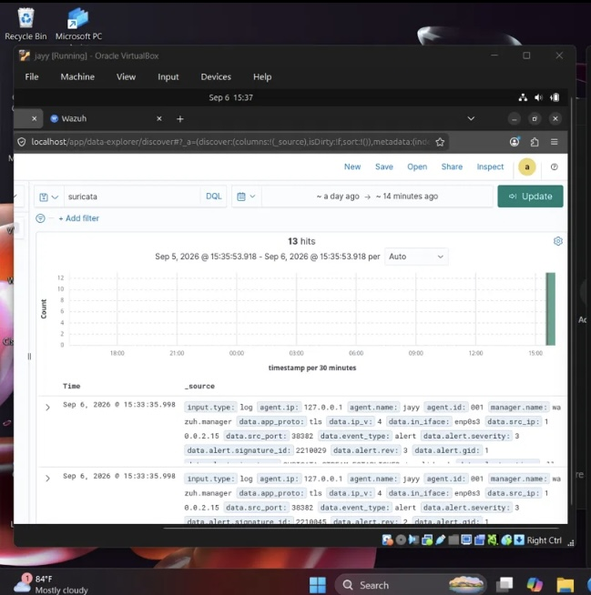
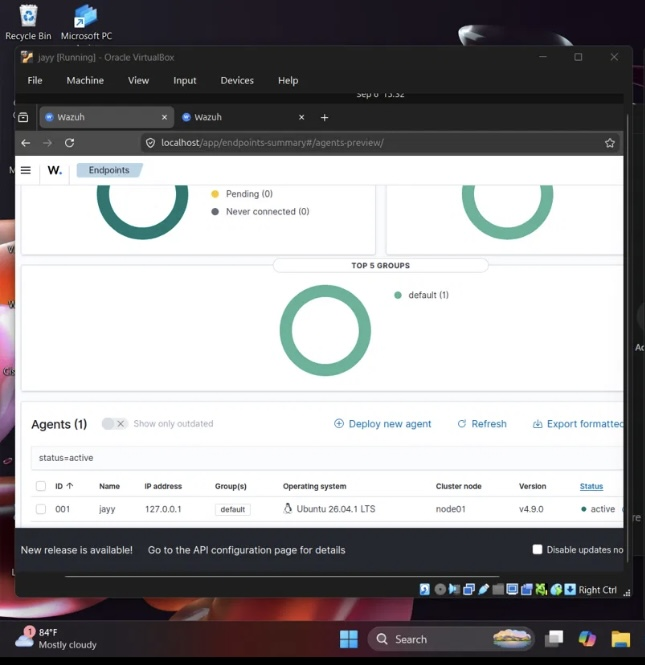
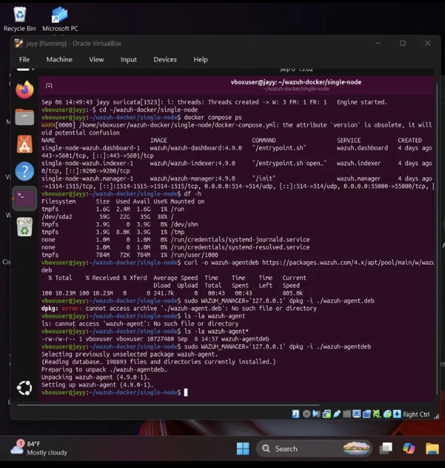
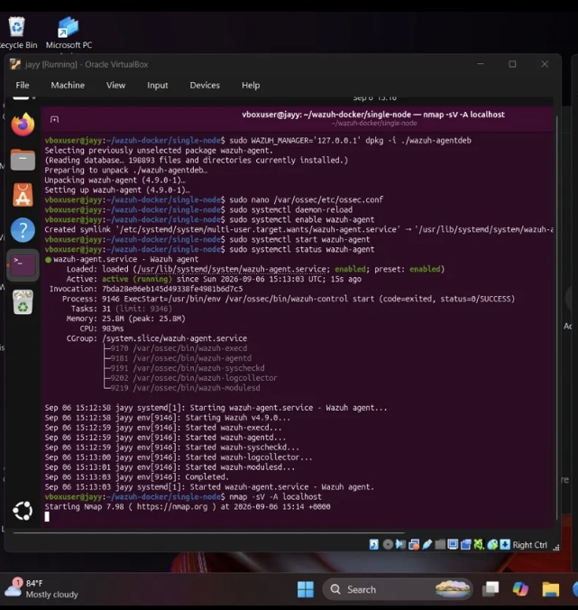
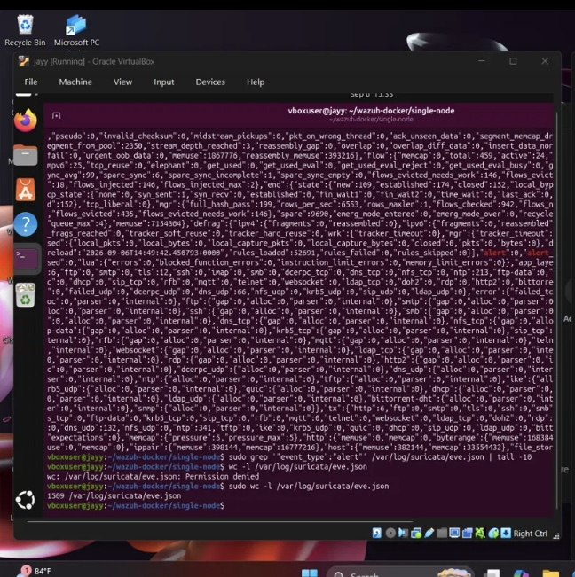

🛡️ Home SOC Lab — Wazuh SIEM + Suricata IDS

📌 Project Overview

This project documents the build of a self-hosted Security Operations Center (SOC) lab created for hands-on cybersecurity training.

The lab was built inside an Ubuntu virtual machine using Oracle VirtualBox and combines Wazuh SIEM with Suricata IDS to create a practical security monitoring and alert-detection environment.

The objective was to deploy Wazuh and Suricata, integrate them together, generate controlled network traffic, and verify that Suricata alerts could successfully flow into the Wazuh dashboard.

🧰 Lab Environment

* OS: Ubuntu 26.04
* Virtualization: Oracle VirtualBox
* Containerization: Docker & Docker Compose
* SIEM: Wazuh 4.9.0
* Network IDS: Suricata 8.0.6
* Network Interface: enp0s3
* Testing Tool: Nmap

🏗️ What I Built

The lab included:

1. Docker Engine and Docker Compose installation
2. Wazuh SIEM deployment
3. Wazuh indexer, manager, and dashboard configuration
4. Suricata IDS installation and configuration
5. Wazuh Agent installation
6. Suricata eve.json log forwarding into Wazuh
7. Network traffic generation using Nmap
8. Live IDS alert verification inside the Wazuh dashboard

🔄 Detection Pipeline

Network Traffic
      ↓
   Suricata IDS
      ↓
   eve.json
      ↓
 Wazuh Agent
      ↓
 Wazuh Manager
      ↓
 Wazuh Indexer
      ↓
 Wazuh Dashboard

🔎 Verification

The final test successfully generated Suricata network alerts that were forwarded through the Wazuh Agent and processed by the Wazuh Manager.

The Wazuh dashboard displayed searchable Suricata alert documents, confirming that the complete detection and logging pipeline was functioning.

🛠️ Troubleshooting Experience

Several real problems were encountered and resolved during the build, including:

* Docker GPG key permission errors
* Docker repository/codename compatibility issues
* IPv6 connectivity problems
* DNS resolution failures
* Virtual machine disk exhaustion
* Suricata network-interface configuration
* Wazuh Agent installation/file-name issues
* Initial Nmap testing against the wrong interface

One major recovery involved expanding the VM’s virtual disk after the original 25 GB disk became completely full. The partition and filesystem were successfully expanded, restoring the system without data loss.

💻 Skills Demonstrated

* Linux system administration
* Docker & Docker Compose
* Wazuh SIEM
* Suricata IDS
* Security monitoring
* Log collection and forwarding
* Network traffic analysis
* DNS troubleshooting
* VirtualBox administration
* Root-cause troubleshooting
* SOC alert validation
* Incident investigation fundamentals

📄 Full Portfolio Report

The complete step-by-step documentation, screenshots, troubleshooting process, and results are available in:

Home SOC Lab Portfolio PDF

🚀 Future Improvements

Planned extensions include:

* Deploying a deliberately vulnerable target such as DVWA or Metasploitable2 in an isolated network
* Creating dedicated Suricata dashboards
* Writing and testing custom Suricata detection rules
* Expanding Wazuh File Integrity Monitoring and Vulnerability Detection
* Practicing complete SOC incident write-ups
* Creating more realistic attack-and-detection scenarios

⚠️ Disclaimer

This project was created in an isolated virtual machine environment for educational and cybersecurity training purposes.

Author- John Segun. A

## Screenshots

### Suricata Alerts in Wazuh

### Active Wazuh Agent

### Wazuh Docker Stack

### Agent Installation + Nmap

### Suricata Logs

Cybersecurity Portfolio Project | Home SOC Lab
